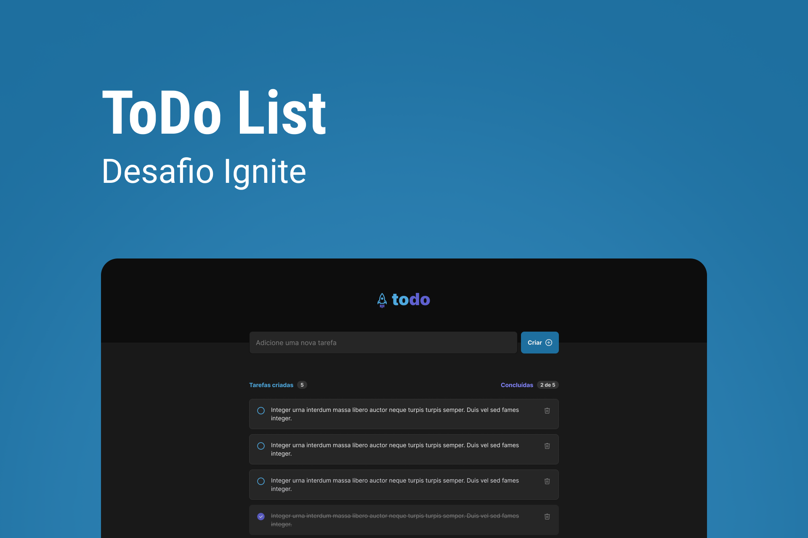

<p align="center">
  
</p>

<p align="center">
    
    
    
    <a href="LICENSE"></a>
</p>

## 💻 Projeto

Aplicação de calendário da Copa do Mundo 2022.

## ✨ Tecnologia

- [React](https://www.w3schools.com/html/)
- [ViteJS](https://www.w3schools.com/css/default.asp)

## 🚀 Como executar

Para executar em ambiente de desenvolvimento, rode os seguintes comandos:

```bash
cd todo-list
yarn dev
```

## 🔖 Layout

Você pode visualizar o layout do projeto através do link abaixo:

- [Layout](<https://www.figma.com/file/PVNfOvQj4U8w0Y7Lpr45Fo/ToDo-List-(Copy)?node-id=0%3A1&t=TcjmCf5l9vcft4W0-1>)

Lembrando que você precisa ter uma conta no [Figma](http://figma.com/).

## 📝 License

Esse projeto está sob a licença MIT. Veja o arquivo [LICENSE](LICENSE) para mais detalhes.

---

<p align="center">
  Feito com 💚 by <a href="https://github.com/odenirdev">Odenir Gomes</a>
</p>

<p align="center">
  🔴 Toda jornada foi transmitida na <a href="https://www.twitch.tv/odenirgomesdev">Twitch</a>
</p>
